### Lession1 .

8086CPU都是在实模式下启动，然后进入保护模式。

- 实模式下，内存寻址方式为16位寄存器的内容左移四位当作段基地址，加上16位偏移地址形成20位的物理地址；并且在实模式下，所有的段都是可读、写和执行的
- 保护模式下，提供了段间的保护机制，访问的内存空间变大
- **在保护模式下，对一个段的描述则包括3方面因素：[Base Address, Limit, Access]，它们加在一起被放在一个64-bit长的数据结构中，被称为段描述符**

**GDT：全局描述表（GDT，Global Descriptor Table）**

​	保护模式下，段描述符为64bit，无法通过16bit长度的段寄存器来直接引用64bit的段描述符，因此可以将这些描述符映射到数组中，而段寄存器中的值作为下标索引来间接引用，这个全局的数组就是GDT。

> ​	1、在保护模式下，对一个段的描述则包括3方面因素：[Base Address, Limit, Access]，它们加在一起被放在一个64-bit长的数据结构中，被称为段描述符，**段描述符的结构：**
>
> 
>
> ​	2、段描述符使用数组存储，使用LGDT指令将GDT的入口地址装入GDTR寄存器。
>
> ​	3、段选择子，一个16位的数据结构，**段选择子的结构：**
>
> 
>
> ​	索引号即作为GDT数组的下标，索引号只有13位，所以，GDT数组最多有8192个元素。

**IDT：中断描述符 Interrupt Descriptor Table**

​	IDT记录了0-255的中断号和调用函数之间的关系，段描述符使用数组存储，使用LIDT指令将IDT的入口地址装入IDTR寄存器，中断描述符结构如下：

## Lession 2. bootsect.s

> 图灵机：基础的计算模型
>
> 冯诺依曼机：输入设备，输出设备，控制器，存储器，运算

计算机开机之后启动的第一条命令是什么？

- 由IP决定，而**IP则由硬件设计者**决定
- 以x86CPU为例
  - x86PC刚开机时CPU处于实模式
  - CS=0xFFFF；IP=0x0000
  - 寻址到0xFFFF0
  - 检查RAM，磁道，显示器，软硬磁盘
  - 将磁道0扇道0读入到0x7c00处
  - 设置CS为0x07c0,ip=0x0000

引入的是**引导扇区**,大小为512B

- 引导扇区代码bootsect.s将自身所在位置移动到0x9000处,为了给以后的操作系统留出空间
- 使用int 0x13 BIOS从磁盘读入setup扇区
- 显示系统加载logo
- 读入system模块

## Lession 3.setup.s

- 获取硬件参数，包括内存大小
- 将system代码转移到0地址处
- 进入保护模式(寻址模式改变),为了加大寻址空间
  - CPU解释方式改变
  - 寻址从20位转为32位
  - cr0变为1,cr0寄存器**非常重要**
- 在保护模式下可以通过GDT表项来进行32位寻址

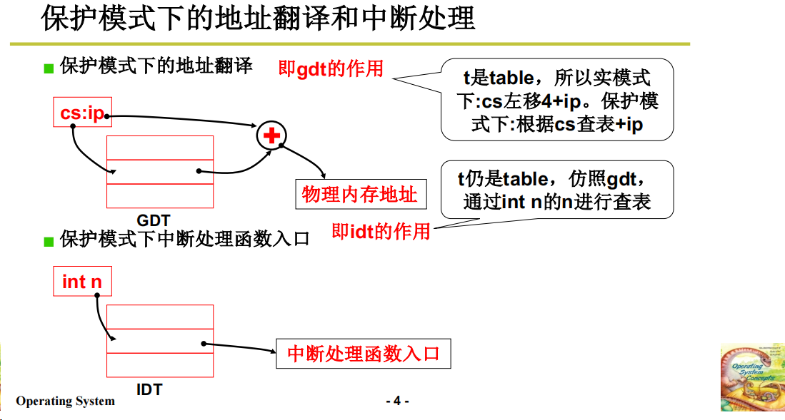

GDT表项结构:上下各存两个字

---

**跳转System模块**

- system 模块的第一步部分是 head.s 之后才是 main.c 
- Makefile 提供了制作 image 的全部过程，包括`bootsect setup system build`

**head.s**

- head.s 在保护模式下运行的代码
- setup是进入保护模式，head是进入之后的初始化
- 更新GDT,IDT表。初始化页表
- head.s 是32位汇编了
- 跳转 main.c ,通过栈压栈来进行，同时根据栈设置了三个main函数的参数以及L6这个返回地址
  - L6是一个死循环命令

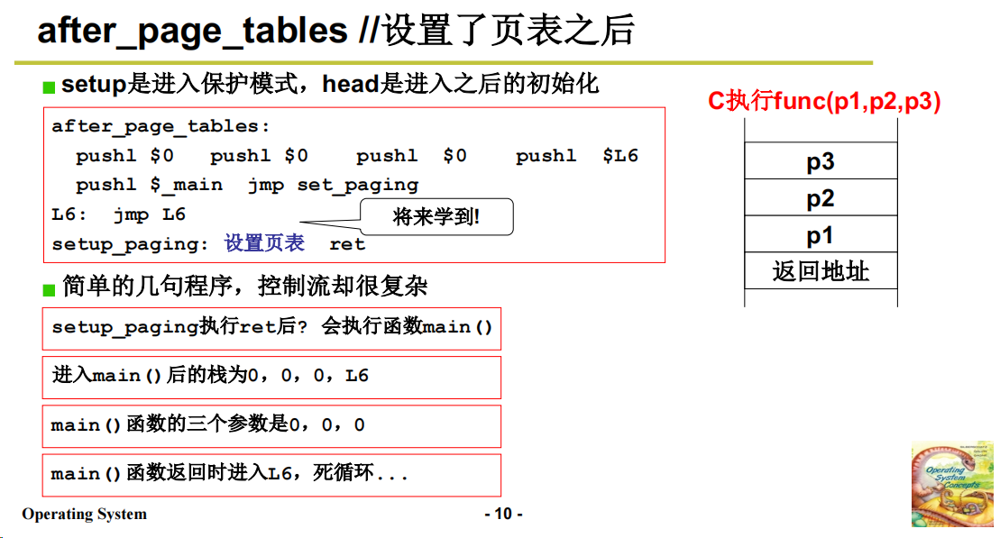

main.c 函数进行一些初始化

boot载入操作系统，setup初始化 + 进入保护模式,head初始化页表，main初始化操作系统

## Lession 4.

命令行也是一个程序

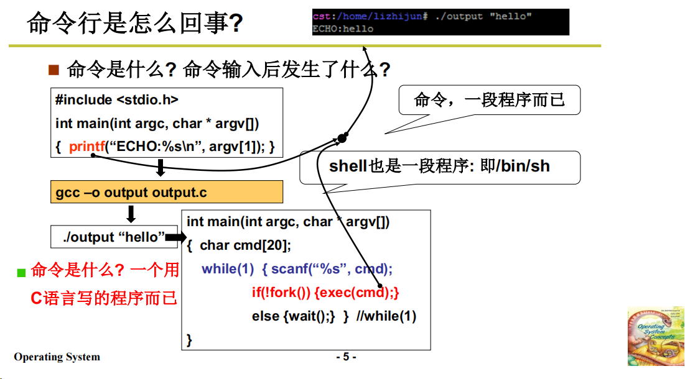

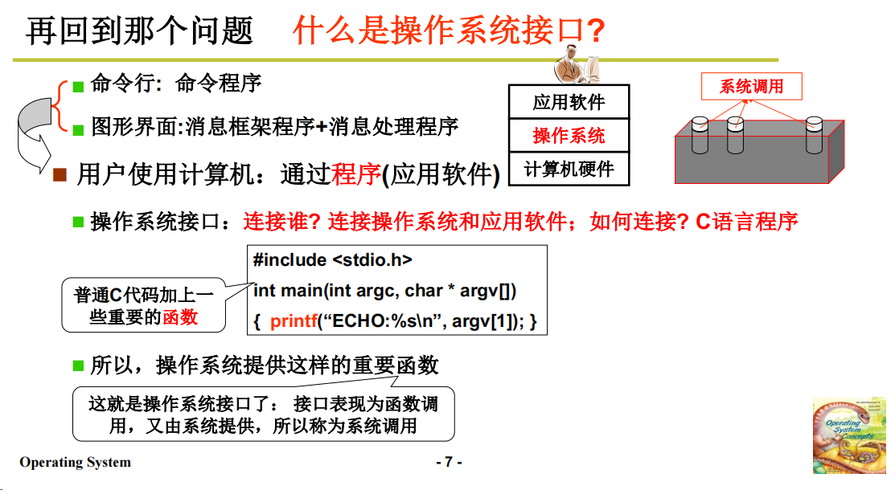

- 为了保证接口之间的规范性，POSIX，由IEEE定义标准

## Lession 5.

通过硬件设计来区分内核态和核心态，CS的最低位置0是内核态，3是用户态

在程序执行过程中如果涉及内核，通过中断指令int 跳转使用内核代码（系统调用）（int 0x80）

> DPL？CPL？IDT？
>
> gate 中断处理门
>
> 操作系统的中断处理程序设置 DPL为3，
>
> 只有DPL为3才能跳转到
>
> CPL为0，执行system_call
>
> 系统调用执行该位置代码
>
> 初始化时，设置0x80号的DPL设置为3，故意让用户的代码可以进来；一旦进来之后就可以使用户特权级设置为0，进而执行内核态

！！！[究竟是什么时候才设置了0x80的中断]

sys_call_table是一个全局函数数组

通过int 0x80来将DPL设置为3，此时DPL和用户CPL一样，就可以执行int 0x80代码设置用户CPL为0

---

- 系统调用
- 区分内核态和用户态：一种处理器“硬件设计”，由CS的最低两位表示：0是内核态，3是用户态
- CPL(CS段寄存器的底二位),Current，当前特权级。程序的特权级是由程序当前所处的段的特权级来决定，当前端的CPL。PC是由CS和IP组成，CS就指向了当前端，即可以得出当前端的特权级。
- RPL（DS段寄存器的底二位）
- DPL代表**目标内存段的特权级**，系统初始化时被设置为 0 ，DPL字段存在于GDT表中，GDT表项用来描述一段内存
- 在调用目标段的代码时需要**当前特权级<=目标段代码的特权级**,否则就会被阻断
- 硬件也提供了主动进入内核的方法：int 中断指令

系统调用的核心：

1. 用户程序包含一段含有int指令的代码 --- 包含 int 指令的代码
2. 操作系统写中断处理，获取想调用程序的标号
3. 操作系统根据标号执行相应代码

- 库函数会根据所调用的参数等来调整，并将其送至系统函数/库函数

---

- write.c 调用syscall，syscall 是由头文件 unistd.h 宏定义的
  - unistd.h 中的syscall宏定义将 write.c中的调用展开，展开成包含int 0x80中断的C语言内嵌汇编代码
- *__NR_##name = __NR_write*，__NR_write 是系统调用号，放在 eax

---

int 0x80中断的细节
- 传入的 eax = 功能号
- 通过 IDT 表来查询 0x80 中断程序所在位置
- sched_init 函数初始化 0x80 的系统调用
  - set_system_gate是一个宏定义通过调用 _set_gate 宏定义函数，并且传入中断号以及中断函数的地址来进行初始化（IDT 表项）
  - 此时DPL会被设置为3，用IDT表项中的段地址和函数入口地址来更新PC
  - 因为CS段此时为8，因此此时的CS底二位为0，CPL为0

- 80号中断的DPL为3，让用户代码CPL为3的程序可以跳转80号中断
- 进入到80号中断后，根据IDT表项，此时CPL为0，即进入了内核态
- 中断返回时又会将CPL设置为3

---

system_call

- system_call_table，调用的是一个函数指针表
  - 每个函数的地址占32位，四个字节

用户调用printf，库函数将printf展开成 int 0x80；int 0x80在初始化时被设置成 sy	stem_call,system_call中根据调用函数号来查表system_call_table，之后调用真正的目标sys函数 

[printf到system_call](https://blog.csdn.net/qq_40459977/article/details/123364591)

- 0x80中断在初始化的时候，该段gate的DPL被设置为3，用户可以直接访问
- 通过查IDT表进入0x80中断将用户CPL设置为0，之后才有权限进入sys_call函数进行更多的系统调用：write,read,....

---

int 0x80的过程：

- 用户调用函数时，库函数会使用一段包含`int 0x80`中断的代码来调用系统调用
- 在调用的时候会设置好`系统调用号`
- `IDT`表中 0x80 中断的 DPL为3，因此用户可以直接调用 80 中断
  - 在`set_system_gate`和中被设置的
  - 在设置的过程中，该IDT表项中，的段选择符为0x8，DPL为3
  - 调用该中断的时候，CS被设置为8，CPL就被设置为了0
  - 此时通过CS：IP（保护模式，需要查GDT表）的组合即可让PC访问到system_call的地址

- 通过system_call就完成了系统调用

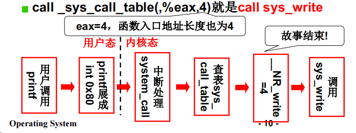

---

IDT表项结构：

Lab2

## Lession 6.操作系统历史

OS/360：多任务多进程结构

MULTICS：分时系统

UNIX:

- 多进程图像
	- CPU
	- 内存
- 文件操作图像
	- IO
	- 磁盘
	- 文件	

图灵机和冯诺依曼机：

> ​	图灵机模型是现代计算机的理论模型"它的最大贡献是证明了有些问题是可以通过有限的、机械的步骤得以解决的"这类可以通过有限的!机械的步骤得以解决的问题是可计算的问题。
>
> ​	输入设备的功能是实现数据(计算对象的二进制表示*和指令从计算机外部到存储器的过程"输出设备是实现计算结果从存储器到计算机外部的过程%存储器用于存储!读和写数据和指令%控制器用于执行指令"每执行一条指令"完成一次操作"通过执行一系列指令"完成构成某个计算过程的一系列操作步骤%运算器用于实现数据的运算过程"这些运算过程包括两个数据的四则运算过程和逻辑运算过程等。

- 通用图灵机主要有纸带和读写头组成，在图灵机模型中只要设计了足够的指令集结构就可以计算出任何的问题。
- 冯诺依曼机则是在图灵机的基础上添加了运算器；把纸带作为存储，读写头作为控制器，并额外添加了输入、输出。

> ​	输入设备将数据输入到存储器中，存储器用于存储、读、写数据和指令，控制器执行存储器中的指令，运算器实现数据的运算过程和运算逻辑，输出设备用于将计算结果从存储器输出到计算机外部。

批处理系统：批处理任务无须人工交互，所有的输入数据预先设置于程序或命令行参数中。这是不同于需要用户输入数据的交互程序的概念。

UNIX，Linux：

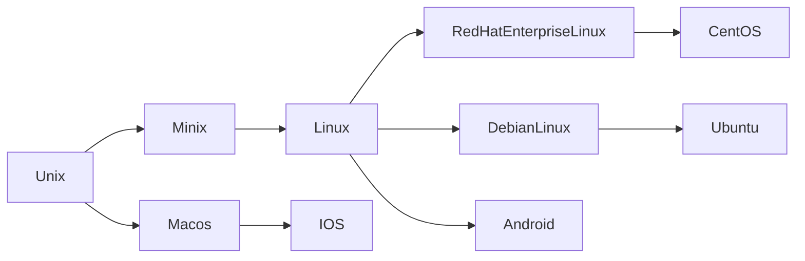

CMOS：

- 是电脑主板上的一块可读写的[RAM](https://baike.baidu.com/item/RAM/144481?fromModule=lemma_inlink)芯片。因为可读写的特性，所以在电脑主板上用来保存BIOS设置完[电脑硬件](https://baike.baidu.com/item/电脑硬件/165440?fromModule=lemma_inlink)参数后的数据，这个芯片仅仅是用来存放数据的。

- 而对BIOS中各项参数的设定要通过专门的程序。[BIOS](https://baike.baidu.com/item/BIOS?fromModule=lemma_inlink)设置程序一般都被厂商整合在芯片中，在开机时通过特定的按键就可进入BIOS设置程序，BIOS一般是ROM。

## Lession 7

- 文件管理

  - open normal file.

  - open dev file.

---

## Lession 8.

- CPU工作流程就是取指（PC指向的位置）、执行

- 存在IO操作时，CPU的利用效率会大幅度下降
  - 并发多道程序同时交替执行
  - 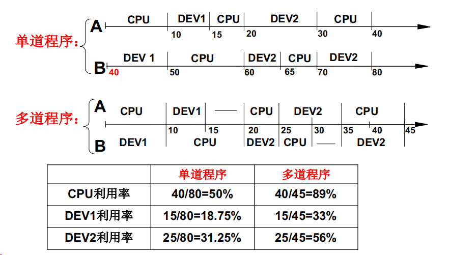
- 如何保存当前程序的状态？，，
  - 使用`PCB`记录当前程序 + 产生使用的信息
  - `PCB`存放进程信息
  - 程序 + 这些不一样的描述 => 进程 
  - 一个程序可以有多个进程 
  - 进程是进行中的程序
    - 进程有开始、结束
    - 进程会走走停停
    - 进程需要记录ax,bx,...
    - .....

## Lession 9.

- 多个进程推进，操作系统将这些进程记录好、按照合理的次序推进（分配资源，进行调度）
- 操作系统让用户使用计算机，创建一个进程，启动Shell
- 一个命令启动一个进程，返回Shell之后再执行其余的进程
- 操作系统感知和组织进程全靠`PCB process control block`
- 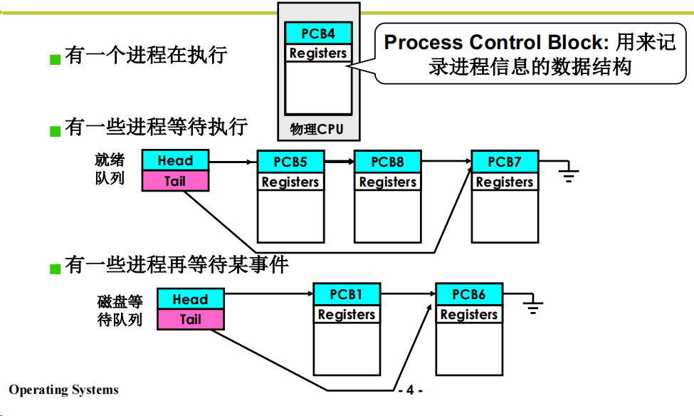
- 多进程的组织：PCB + 状态 + 队列
- 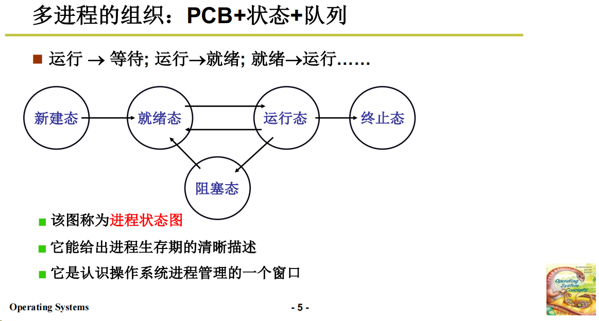
  - 执行进程
  - 就绪状态
  - 等待：等待某一事件的完成
- 交替的三部分
  - 队列操作
  - 调度
  - 切换
    - 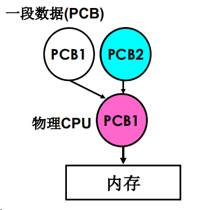
  - 进程PCB：switch_to来交换
- 如何处理多进程的影响
  - 多进程的地址空间分离：内存管理的主要内容
  - 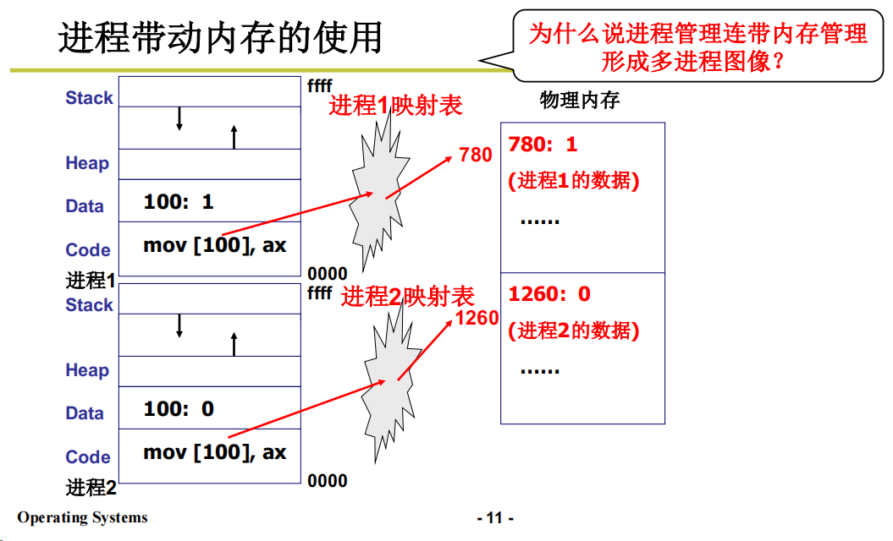

- 多进程合作
  - 生产者消费者模型
  - 进程同步（合理的推进顺序）（上锁）

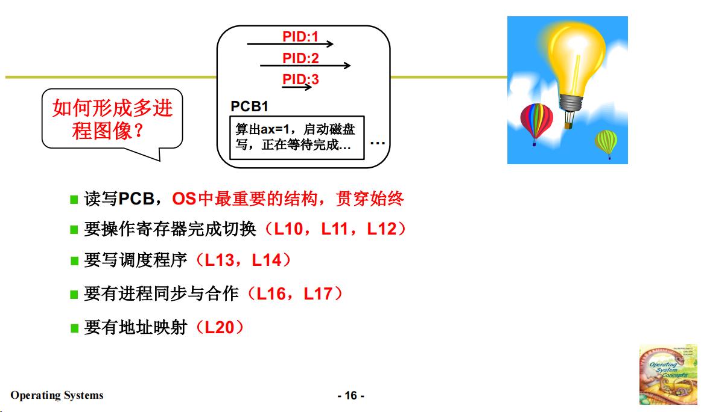

## Lession 10. 用户级线程

操作系统如何切换起来，

线程（**thread**）：保留了并发的优点，避免了进程切换的代价。

- 将资源（内存）和指令序列分开
- 一个资源 + 不同的指令序列就形成了不同的线程图像。
- 不需要切换地址映射表
- 相较于进程，比较轻巧
- 多个执行序列 + 一个地址空间
- 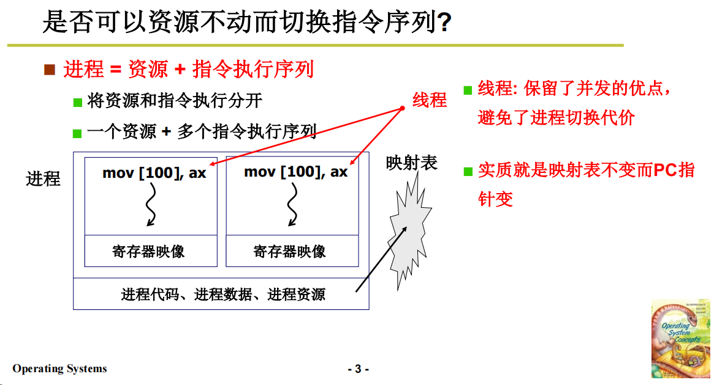

切换线程

- **yield**
- **TCB**
- 归根结底，线程的切换就是各种状态的切换与改变。
- 使用 yield 切换的时候，直接弹出栈就可以，不用`jmp`，此时就已经回到了线程A
- 为了避免两个线程共享资源的时候发生函数返回地址相关的问题，从一个栈到两个栈，通过 Yield 来切换栈。
- 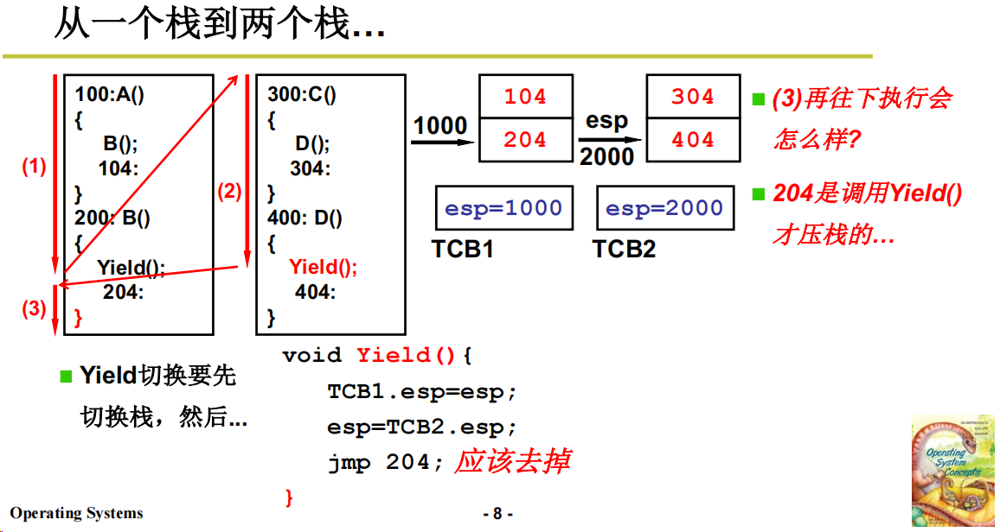
- Create 也属于 yield
- 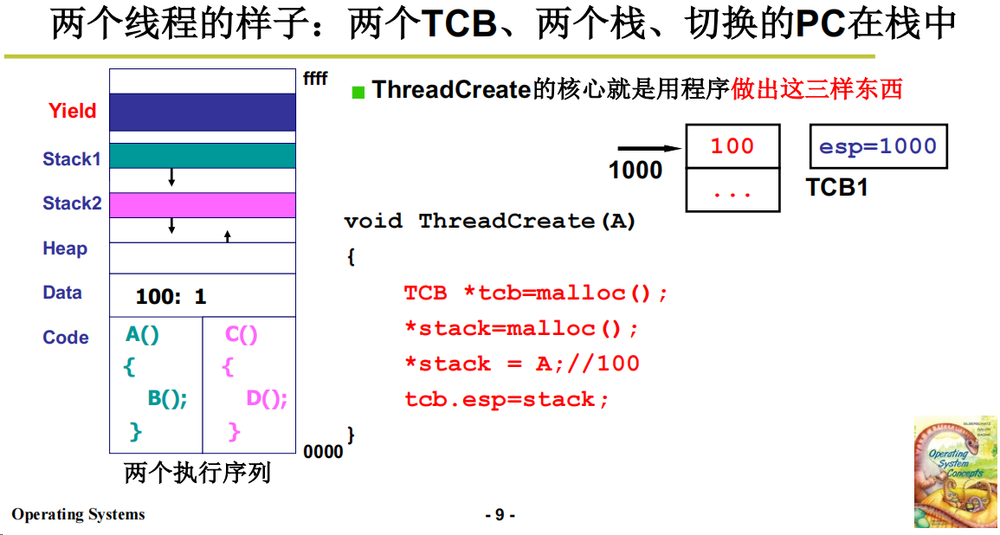
- 用户级线程  Yield
- 核心级线程  Create
  - Yield   : 让出
  - Schedule: 安排
  - 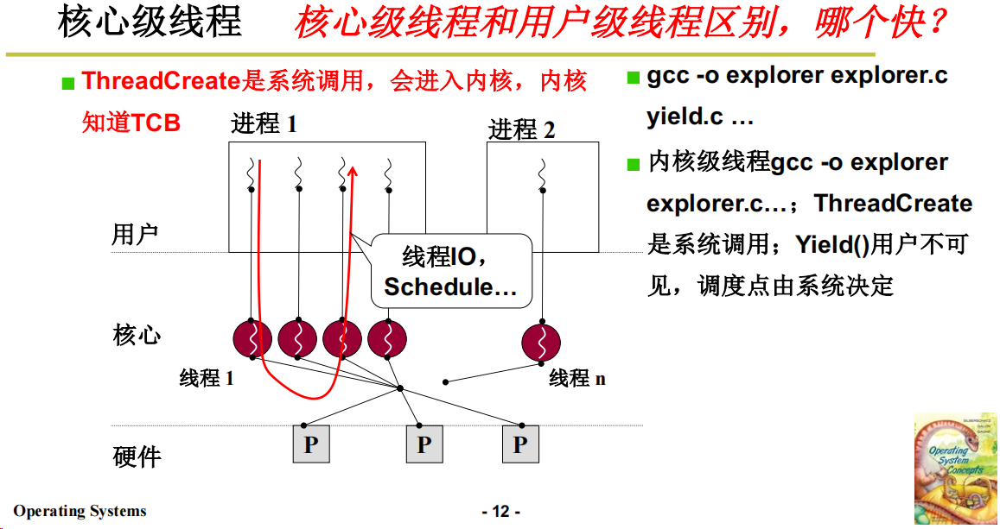
- 每个指令序列归根结底还是一个个函数调用。

## Lession 11.内核级线程

操作系统必须包含的部分：

- 用户级线程
- 核心级线程
- 核心级进程 

由用户级线程到核心级线程

- 一个栈到**一套栈（用户栈 + 内核栈）**

- 核心级线程切换从上到下
- 只有内核级线程才是处理机分配的单位

为什么要引入内核级线程？

- 利用多核资源来并发
- IO密集型情况
- 更好的系统调用
- 更好的内核支持
- 。。。

常见的多线程对应机制

- 一对一：一个用户级线程对应一个核心级线程
- 多对一：多个用户级线程对应一个核心级线程
- 多对多：多个用户级线程对应多个核心级线程

**进程并发与线程并发：**

